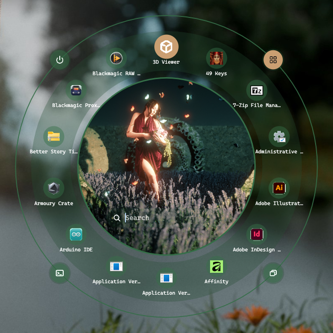
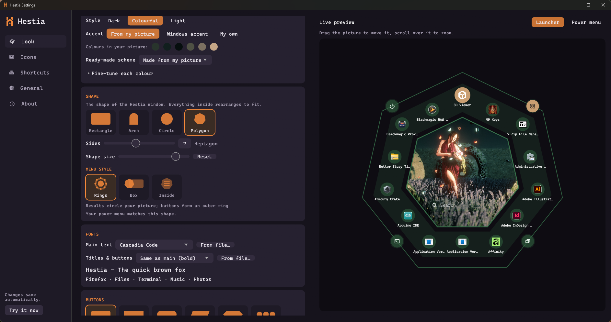

<p align="center">
  
</p>

<h1 align="center">Hestia</h1>

<p align="center">
  A friendly, good-looking launcher for Windows, built around a picture you love.<br>
  Named after Hestia, the Greek goddess of home and hearth.
</p>

<p align="center">
  
  &nbsp;
  
</p>

Press a shortcut, type a few letters, and open an app, switch windows, run a
command, or lock, sleep or restart your PC. Hestia is inspired by
[rofi](https://github.com/davatorium/rofi) and adi1090x's beautiful
[rofi themes](https://github.com/adi1090x/rofi), but made for Windows and for
people who'd rather click than edit config files.

## Features

* **App launcher**: finds Start-menu and Microsoft Store apps, with fuzzy search
  ("vsc" finds Visual Studio Code) and your most-used apps first
* **Window switcher**, **Run box** and **power menu** (lock, sleep, hibernate,
  sign out, restart, shut down, with a confirmation step)
* **Built around your picture**: choose an image, drag and zoom to frame it,
  and Hestia suggests colours from it (dark, colourful or light, with an accent
  from your picture, from Windows, or your own)
* **Many shapes**: classic rectangle layouts recreated from adi1090x's themes,
  or an arch, circle or any polygon, with results on **rings** around your
  picture, in a **box** beside it, or **inside** the shape
* **Make it yours**: button shapes, any installed font, your own `.svg` or
  `.ico` icons, blur / acrylic / mica (Windows 11), opacity, size and roundness
* **Shortcuts you choose**, recorded by simply pressing them
* **Easy to live with**: setup wizard, live preview, tray icon, starts with
  Windows, settings save automatically

## Install

1. Download `Hestia.zip` from the [latest release](../../releases/latest).
2. Unzip it and double-click **Install Hestia.bat**.
   Windows may say "Windows protected your PC" because Hestia isn't signed with a
   paid certificate. Click **More info**, then **Run anyway**.
3. A setup window opens. Pick a picture, colours and a shape, and you're done.

To remove Hestia, run **Uninstall Hestia.bat** from the same folder.

## Using Hestia

| Shortcut       | Opens            |
| -------------- | ---------------- |
| Alt + Space    | App launcher     |
| Ctrl + Alt + W | Window switcher  |
| Ctrl + Alt + R | Run a command    |
| Ctrl + Alt + P | Power menu       |

Type to search, click or press Enter to open, Tab to switch tabs, Esc to close.
Right-click any item for more options such as *Run as administrator*. Open
Settings from the Hestia icon near the clock.

Settings live in `%APPDATA%\Hestia\config.toml`, a readable text file. Share
its `[look]` section to share your theme.

## Building from source

You need Windows, [Rust](https://rustup.rs) (MSVC toolchain) and the Visual
Studio C++ build tools.

```powershell
cargo run              # test build, with a console window for log messages
.\release.bat          # finished build + dist\Hestia.zip with the installer
```

Every push is built by GitHub Actions. Pushing a tag such as `v1.0.0` publishes
a release with `Hestia.zip` attached.

### Project layout

| File | What it does |
| ---- | ------------ |
| `src/popup.rs` | The background app: hotkeys, tray icon and the popup |
| `src/settings.rs` | Settings window and setup wizard |
| `src/layout.rs` | Layout engine and all built-in layouts and shapes |
| `src/palette.rs` | Colours from pictures, colour schemes |
| `src/apps.rs`, `src/platform.rs` | Finding apps and talking to Windows |
| `src/icons.rs`, `src/fonts.rs` | Icons (app, SVG, ICO) and fonts |

## Credits

* Rectangle layouts and colour schemes are recreated from
  [adi1090x/rofi](https://github.com/adi1090x/rofi) (GPL-3.0).
* Several built-in icons follow the shapes of [Feather Icons](https://feathericons.com) (MIT).
* Built with [egui](https://github.com/emilk/egui) and many other great Rust crates.

## License

Hestia is free software under the [GNU General Public License v3.0 or later](LICENSE).
